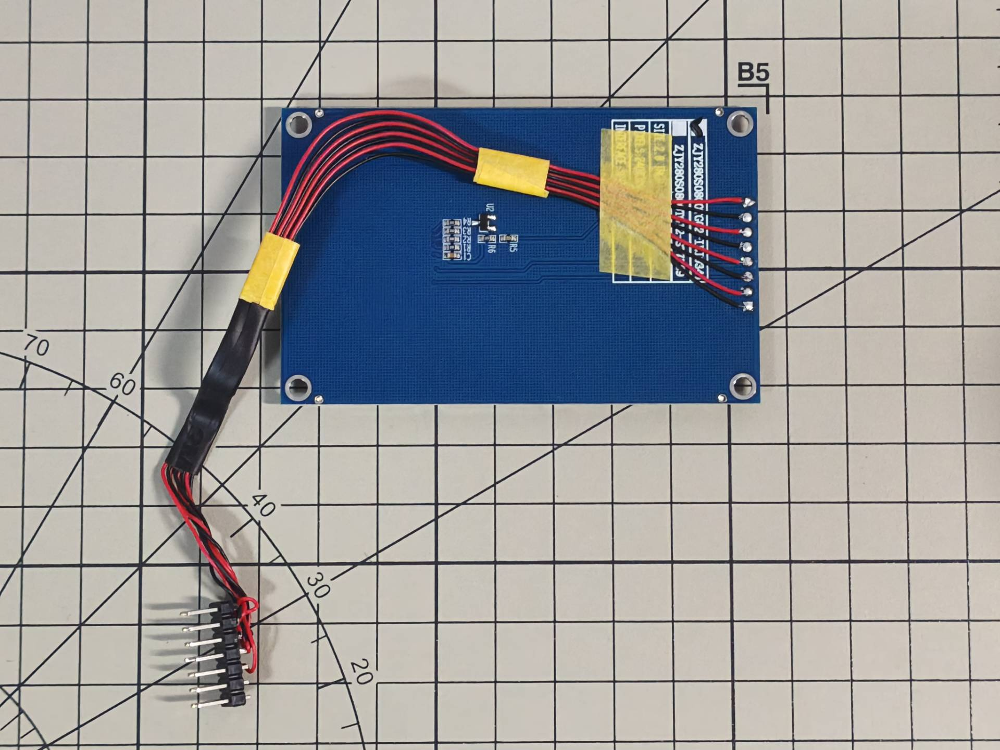

# Cap TFT V2 - 2.8 Inch Display Expansion for Cardputer ADV

Cap TFT V2 is a display expansion module designed for Cardputer ADV, featuring an integrated 2.8 inch ILI9341 display (320x240)

## BOM List

1. 3D printed shell D1
2. 3D printed shell D2
3. 3D printed shell D3
4. 3D printed shell L1
5. 3D printed shell R1
6. 3D printed shell S1
7. 3D printed shell C1
8. 2.8 inch ILI9341 display
9. M2x4 hex socket flat head bolts - 4 pieces
10. M2x5 hex socket cap bolts - 3 pieces
11. 2.54mm 2x7P dual-row straight pin header

Display dimension specifications

## Assembly Instructions

Connect the display to the pin header using thin wires as shown in the diagram. It is recommended to use cable with an outer diameter of 0.65mm. For the wiring definition, please refer to the table below.

Display

| GND  | VCC  | SCL  | SDA  | RES  | DC   | CS   | BLK  |
| :--: | :--: | :--: | :--: | :--: | :--: | :--: | :--: |
| 1    | 2    | 3    | 4    | 5    | 6    | 7    | 8    |

Cardputer

| G3   | G4   | G6   | G40  | G14  | G39  | G5   |
| :--: | :--: | :--: | :--: | :--: | :--: | :--: |
| 5    | x    | 6    | 3    | 4    | x    | 7    |
| 5VIN | GND  | 5VOUT| SDA  | SCL  | G13  | G15  |
| 8    | 1    | 2    | x    | x    | x    | x    |

Install the display onto D1

Use 4 M2x4 hex socket flat head bolts to install D2 and D3 onto D1

Install the pin header onto S1

Use 1 M2x5 hex socket cap bolt to assemble C1 and S1

Install L1 and R1 onto D1

Use 2 M2x5 hex socket cap bolts to install L1 and R1 onto S1

Assembly complete

## Credits

- The selection of the new display was inspired by the expansion screen designed by tipflow for Cardputer ADV. Project link: [M5 Cardputer Extended Screen](https://makerworld.com/zh/models/3054465-m5-cardputer-extended-screen?from=search#profileId-3436513)
- The firmware used for the display expansion is modified based on engneer-hamachan's [area512](https://github.com/engneer-hamachan/area512). It is a great retro OS, styled similarly to the handheld Cyberdeck used by the TVA in the TV series Loki
